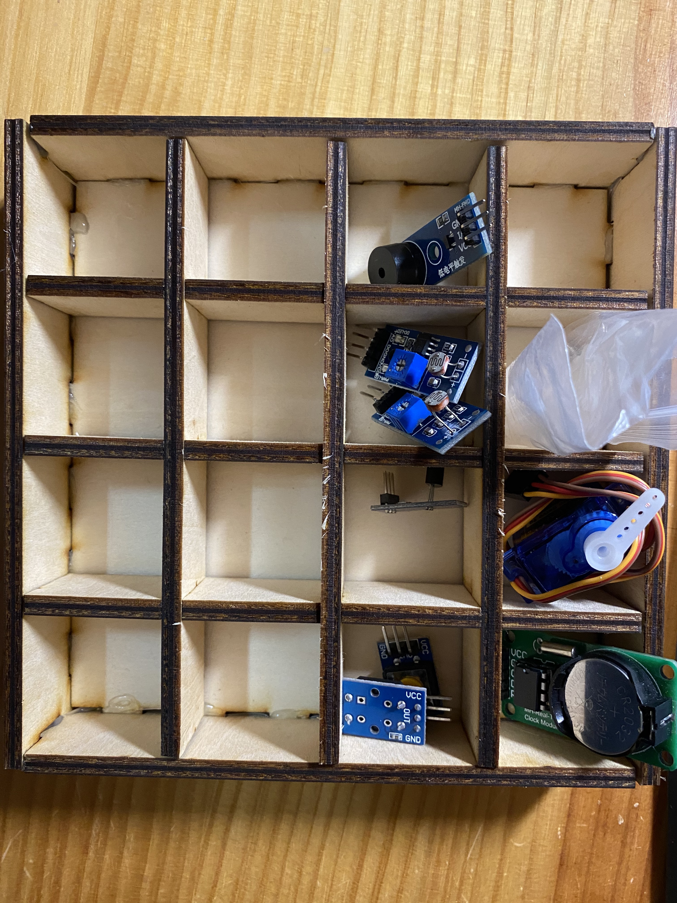
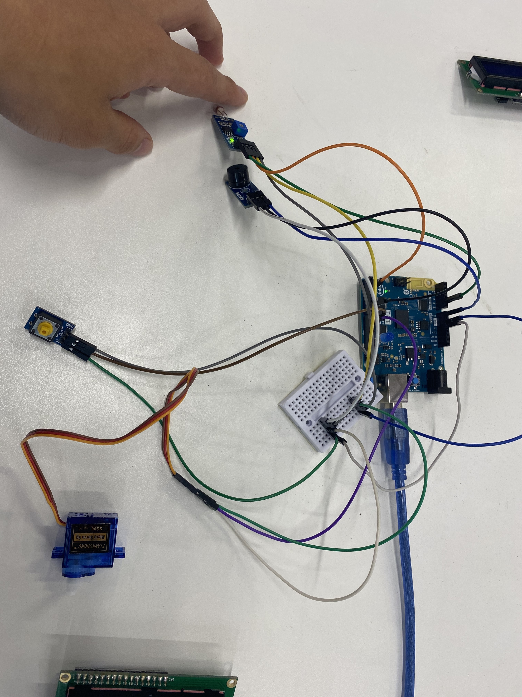

# FABLAB COURSE
Hello，I'm **ZHANG Wei**, a junior undergraduate student from [ShanghaiTech University](http://www.shanghaitech.edu.cn/), who is majoring in Computer Science. And I attend FAB Academy X China course in ShanghaiTech,spring 2020. The followings are my assignments and my final project.

## WEEK 1: Laser Cut， A Storage Box

1. Use fusion 360 to design a simple module.
   
2. Cut a sample  by laser cutter to calculate the kerf.
   1. turn on the laser cutter, the airflow and the exhaust filter.
   2. Insert a sheet of material.
   3. Focus the laser head automatically.
   4. Set the properies of laser cutter in PC and send the file to laser cutter. In my experience, I set the power, speed, PPI be 70%, 3%, 1000, respectively.
I cut a 5 mm by 5 mm square, and then I get a about 4.7 mm by 4.7 mm suare. Therefore, kerf = (5 mm - 4.7 mm)/2 = 0.15 mm
3. Modify my module and cut them.
   
4. Assemble them together.
   
   

## WEEK 2: 3D Print: Finger Tiger
1. Use fusion 360 to design a module.
   1. download a finger tiger picture.
      
   2. sketch the shape and polish it by fusion 360.
    
2. Slicing.
   Adjust the size and location of the module.Set layer height, speed be 0.15 mm, 40 mm, respectively. 
   
   
   
3. Printing. ( the materrial is ABS)
   
   
Due to the precision, the words (Power of Zhang) can't be printed clearly.

Here is the final result: 

   
   
## WEEK 3: Arduino: Luminance Meter   
 Calculate the light and display it by control the servo precisely.
 Also, you can see the specific value of brightness on the lcd screen.
 The range is 0 to 180. The greater the value, the lower the brightness.
 And you can push the button to launch another function.
 If it's dark, then the LED is on and the buzzer rings periodically.
 
 
 In this assignment, at the beginning, I can't find the address of my 1602lcd(driver board is PCF8574T). Even I used [scanner](hw3/scanner.ino), it showed that No I2C devices found. It drove me crazy and just killed meI a nice weekend. But I changed another lcd screen with same driver board PCF8574T, I sucessfully found the correct address is 0x27. Until now I still  can not figure out the reason.      
 
   
## WEEK 4: Build A 2 Axis Machine With An Actuator
This is a teamwork assignment, I work with [Ze Song(宋泽)](https://github.com/Kagamine-Rin/Fablab-Course-Shanghaitech).

## WEEK 5: 3D Scanning 
1. Scan myself and get an obj file.
2. Use MeshMixer to repair the mesh, and add a hat for myself.
   
Here is the final result, add the hat will cost too much material and time, therefore, I remove it.
   
   
## Final Project : Special Alarm Clock(Remind and motivate you to take pills )
   
    
1. Show UTC +8 Standard Time and date precisely.
2. Alarm clock function.
3. Measure the temperature.
4. Special Function : Remind and motivate me to take my medicine in time. You can  take away your coke only if you have already taken away your pills. Otherwise, it will alert and make a noise, and red led will be turned on!  

   
   
   
   
